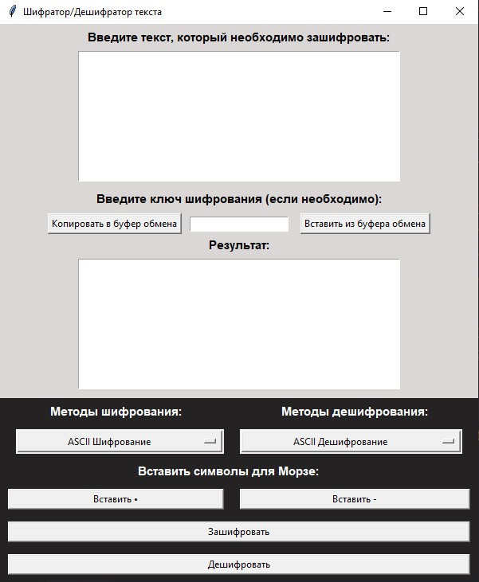

Данная программа позволяет зашифровывать и дешифровывать текст следующими методами:
1. 'ASCII Шифрование',
2. 'Шифрование Цезаря',
3. 'Морзе Русский',
4. 'Морзе Английский',
5. 'Виженер Английский',
6. 'Виженер Русский'

Все методы описаны в функциях внутри класса Cryptext() в файле cryptotext.py.
Чтобы импортировать данный класс в свой файл, введите: 
from cryptotext import Cryptext
obj = Cryptext('Ваш текст / Your text')
obj."НАЗВАНИЕ ФУНКЦИИ"()
Где obj - название переменной.
В файле main.py написано GUI приложение с удобным интерфейсом для  ввода и вывода текста. 
В нем реализовано поле для ввода и вывода текста, кнопки: 
- "Копировать в буфер обмена", (Ctrl + C)
- "Вставить из буфера обмена", (Ctrl + V)
- Так же в поле ввода работает комбинация Ctrl + A - выделить весь текст,
- Выбор метода Шифрования и Дешифрования
- Вставка символов • - (Чтобы программа точно могла воспринимать правильно введенные символы)
- "Зашифровать"
- "Дешифровать"

